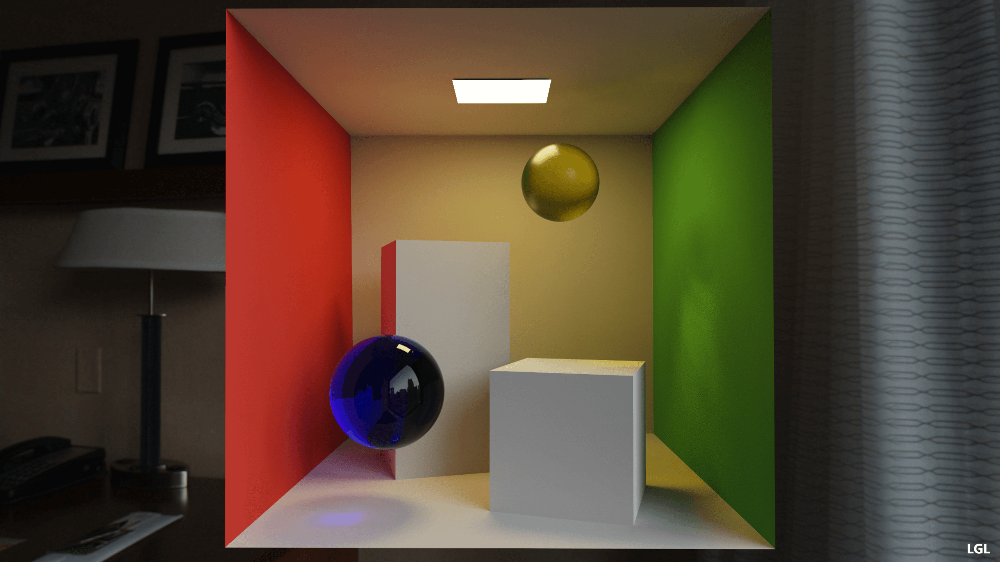
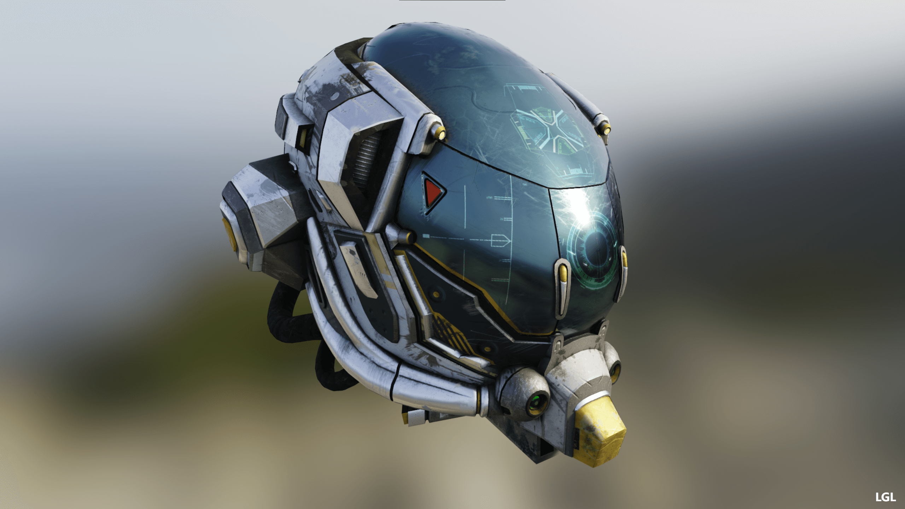
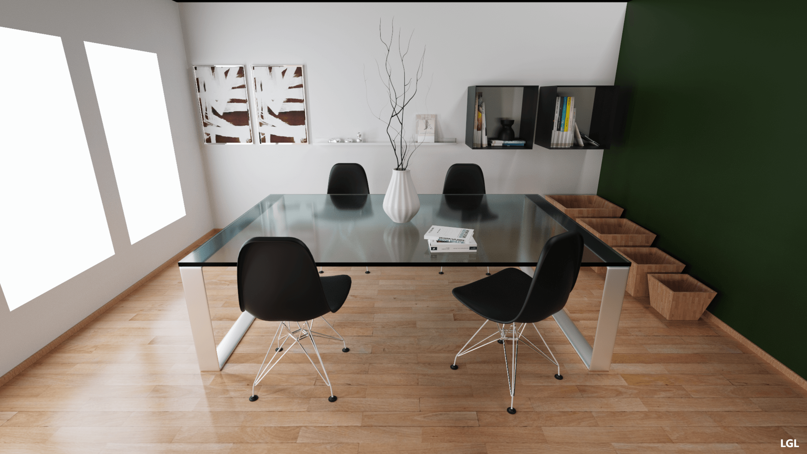
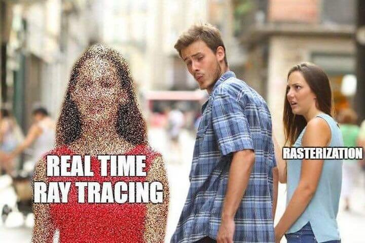
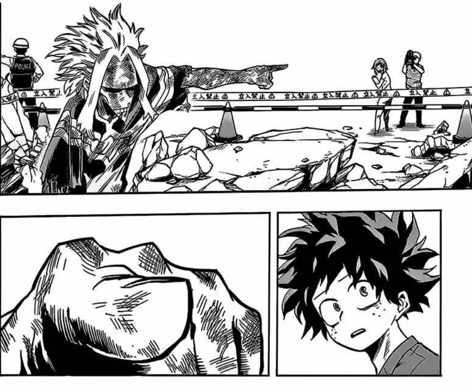

【WebGL与光线追踪】(一) 简介

先上最后结果的渲染器：

[lgltracer](https://lgltracer.com/)

几个Demo和效果图：

[CornellBox](https://lgltracer.com/cornellBox/index.html)

  
  

[GLTF Viewer](https://lgltracer.com/viewer/index.html)

  
  

DiningRoom

  
  

光追的效果是不是让你燃起了曲线救国锤一波Sketchfab的希望呢

  
  

本系列文章就是对自己渲染器的一个总结，包括了涉及的基础理论知识和实践落地遇到的一些问题，在此分享给有缘的兄弟，希望能有所帮助吧。下一个拯救国内Web3D的人，就是你啦！

  
  

话不多说，颠个勺开始吧：

【WebGL与光线追踪】(二) Disney BSDF

【WebGL与光线追踪】(三) Path Tracing

【WebGL与光线追踪】(四) 实践及工程化

材质与Tracing其实都已老生常谈，这里也并没有啥新的东西，关于这两者其实已有很多前辈总结的优秀文章，若是已比较熟悉的兄弟可直接略过。最后是总结了一下实践过程遇到的一些问题。