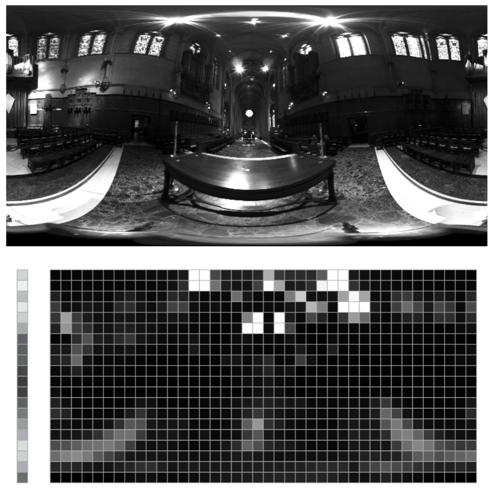

【WebGL与光线追踪】(三) Path Tracing

还是先回顾一些概念：

## 蒙特卡洛（Monte Carlo）积分

一些概率论的基础公式(连续随机变量)：

**概率密度函数(PDF):**

$$
P\{a<x\leq b\}= \int_{a}^{b}f(x)dx 
$$

**分布函数(CDF):**

$$
F(x) = P\{x\leq X\} \\
P\{a<x\leq b\}= P\{x\leq b\} - P\{x\leq a\} = F(b) - F(a) 
$$

**PDF与CDF的关系：**
$$
F(x) = P\{x\leq X\} = \int_{-\infty}^{x}f(x)dx \\
$$
变上限求导可知：
$$
F(x)^ {'} = f(x) \\
$$

**数学期望：**

$$
E[X]=\int_{-\infty}^{+\infty}xpdf(x)dx
$$

对$Y = g(X)$：

$$
E[Y]=E[g(x)] =\int_{-\infty}^{+\infty}g(x)pdf(x)dx
$$

这告诉我们要求E[Y]不用去算Y的分布律或pdf，而只需要X的分布律和pdf即可。

**方差：**

$$σ^{2} = E[(x-E[x])^2] = \int(x-E[x])^2pdf(x)dx$$

**蒙特卡洛积分公式：**

$$
\int f(x) dx \approx \frac{1}{N}\sum_{i=1}^{N}{\frac{f(X_i)}{pdf(X_i)}}\\
$$

该估计的期望：

$$
E[I_N] = E\left [ \frac{1}{N}\sum_{i=1}^{N}{\frac{g(X_i)}{pdf(X_i)}} \right]\\ = \frac{1}{N}\sum_{i=1}^{N}\int\frac{g(X_i)}{pdf(X_i)}pdf(X_i)dx\\ = \frac{1}{N}N\int g(x)dx = \int g(x)dx = I\\
$$

该估计的方差：

$$σ^{2} = \frac{1}{N}\int(\frac{g(x)}{f(x)} - I)^{2}pdf(x)dx$$

由上式可知，方差随着N的增加线性降低，由于估计的误差正比于标准差$σ$，所以蒙特卡洛估计误差收敛的速度为$O(\sqrt N)$，即4倍的采样减少一半误差。

## 采样

### **重要性采样**

对于被积函数，也就是反射方程：

$$
L_o(\omega_{o}) =   \int_\Omega L_{i}\left(p, \omega_{i}\right) f_{r}\left(p, \omega_{i}, \omega_{o}\right)\left(n \cdot \omega_{i}\right)  \\
$$

为了减少方差，需要选择最好是正比于被积函数的PDF来进行采样，即重要性采样

则PDF考虑的三个部分：

### $L_{i}$ incident radiance

对Analytic Lights直接均匀采样即可，如

面光：

$$
p(x)=\frac{1}{A} = \frac{1}{w*h}
$$

球光:
$$
p(x)=\frac{1}{A} = \frac{1}{4\pi r^2}
$$

方向光:

$$
p(x)=1
$$

光源面积dA还需要转换到dw：

$$
d\omega=\frac{dA*n'\cdot\omega_i}{|x^{\prime}-x|^2}
$$

带回反射方程即为：

$$
L_o(o,ω_o)=\int_{\Omega} f_r(p,\omega_i,\omega_o)L_i(p,\omega_i) \frac{n\cdot \omega_i*n'\cdot\omega_i}{|x^{\prime}-x|^2}dA
$$

[------

光源采样推导还可见Game101：

https://zhuanlan.zhihu.com/p/146714484

https://zhuanlan.zhihu.com/p/370162390

------]

**环境光照(无穷大的面光)**

环境光照就并非均匀分布了，所以需要根据亮度对其进行重要性采样：

加载环境图时将环境图的亮度信息存储为一张2维的累积分布纹理:

<div style="text-align: center">  
  
</div>

采样时在X、Y轴取随机数后再通过逆变换算法获取纹理坐标即可，具体可直接看：

https://www.pbr-book.org/3ed-2018/Light_Transport_I_Surface_Reflection/Sampling_Light_Sources#InfiniteAreaLights

https://www.pbr-book.org/3ed-2018/Sampling_and_Reconstruction/Stratified_Sampling

要不要再出两张对比图？

### BRDF $f_{r}$

**Diffuse**

考虑漫反射部分时会结合被积函数中的cos项，进行一个cosine-weighted的重要性采样：

$$
pdf(\omega_i) = c * cos\theta_i
$$

由：

$$
\begin{aligned} &        \int_{\Omega^{+}} pdf(\omega) \mathrm{d} \omega = &   \int_{\Omega^{+}} c * cos\theta_i \mathrm{d} \omega = 1 \end{aligned}\\
$$

得$c = \frac{1}{\pi}$，即：

$$
pdf(\omega_i) = \frac{cos\theta_{i}}{\pi} \\
$$

**Specular**

考虑高光项时，由NDF的定义及其在宏表面投影面积积分为1的归一性：

$$
\int_{\Omega^{+}} \cos \theta D\left(\boldsymbol{\omega}_{h}\right) \mathrm{d} \boldsymbol{\omega}_{h}=1 \\
$$

θ为微观法线h与宏表面法线n的夹角

PDF函数直接取NDF的投影函数即可，但函数是$d{\omega_h}$的函数，需要的是$d{\omega_i}$，还需一个转换，
由上一篇文章的推导可知，在反射的情况下：

$$ \frac{d\omega_h}{d\omega_i} = \frac{1}{4(\omega_h \cdot \omega_i)}\\ $$
即：

$$
\int_{\mathcal{H}^{2}}\frac{ \cos \theta}{4(\omega_h \cdot \omega_i)} D\left(\boldsymbol{\omega}_{h}\right) \mathrm{d} \boldsymbol{\omega}_{i}=1 \\
$$
则：
$$
pdf(\omega_i) = \frac{ \cos \theta D\left(\boldsymbol{\omega}_{h}\right)}{4(\omega_h \cdot \omega_i)}
$$

而对于折射，由：
$$
\frac{d\omega_h}{d\omega_i} = \frac{ \left| i \cdot h_{t} \right| }          { \left| \left| i + \eta o \right| \right|^{2}} 
$$

同理PDF为：

$$
pdf(\omega_i) = \frac{ \cos \theta D\left(\boldsymbol{\omega}_{h}\right) \left| i \cdot h_{t} \right|}{\left| \left| i + \eta o \right| \right|^{2}} 
$$

结合菲涅尔项的代码部分：

```glsl
// Reflection
pdf = D * dot(N, H) * F / (4.0 * abs(dot(V, H)));
// Refraction
float denomSqrt = dot(L, H) + dot(V, H) * si.eta;
pdf = D * dot(N, H) * (1.0 - F) * abs(dot(L, H)) / (denomSqrt * denomSqrt);
```
最后Diffuse部分与Specular部分再结合起来可得：

$$
 ratio\frac{\cos \theta_{i}}{\pi} +  (1-ratio) \frac{ \cos \theta D\left(\omega_{h}\right)}{4(\omega_h \cdot \omega_i)} \\
$$

ratio的取值可以简单粗暴的直接0.5：

```glsl
// https://www.pbr-book.org/3ed-2018/Light_Transport_I_Surface_Reflection/Sampling_Reflection_Functions
Float FresnelBlend::Pdf(const Vector3f &wo, const Vector3f &wi) const {
    ......
    return .5f * (AbsCosTheta(wi) * InvPi + pdf_wh / (4 * Dot(wo, wh)));
}
```
也可以结合金属度参数，手动挡物理起来：

```glsl
float ratio = 0.5 * (1.0 - si.metalness);
```

### **多重重要性采样(multiple importance sampling/MIS)**

观察发现光源采样和BRDF采样在不同情况下各有优缺点，如何将不同的重要性采样结合，就有了多重重要性采样的方法

https://graphics.stanford.edu/courses/cs348b-03/papers/veach-chapter9.pdf

多重重要性采样的估计公式：

$$
I=\sum_{i=1}^{n} \frac{1}{n_{i}} \sum_{j=1}^{n_{i}} w_{i}\left(X_{i, j}\right) \frac{f\left(X_{i, j}\right)}{p_{i}\left(X_{i, j}\right)} \\
$$

由上式可知多重重要性采样其实就是多个重要性采样的一个加权组合。在每个采样区域都是不同采样技术的加权和，为了尽可能发挥每种采样技术的优势，往往希望每个区域贡献更高的采样技术有更高的权重。

无偏证明：

$$
\begin{aligned} E[I] &=\sum_{i=1}^{n} \frac{1}{n_{i}} \sum_{j=1}^{n_{i}} \int_{\Omega} \frac{w_{i}(x) f(x)}{p_{i}(x)} p_{i}(x) dx =\int_{\Omega} \sum_{i=1}^{n} w_{i}(x) f(x) dx=\int_{\Omega} f(x) dx \end{aligned} \\
$$

1.Balance heuristic

权重系数：

$$
w_{i}(x)=\frac{c_{i}pdf_{i}(x)}{\sum_{j} c_{j}pdf_{j}(x)} \\
$$

其中$c_{i}$是每个采样分布对应的抽样数量比例，$c_{i}=\frac{n_{i}}{\N}$。即对于每个采样点计算其在每一个分布中的值(得到分母)，则当前采样点对应的pdf(分子)越大，权重越高。

2.Power heuristic

论文中发现了在低方差的采样策略，使用balance heuristic反而会增加方差，并提出通过锐化(sharpen)调整权重函数来进行优化(减少靠近0的权重，增加靠近1的权重)。并列举了两种方法，cutoff heurisitc和power heuristic，cutoff heuristic即通过设置阈值放弃低权重采样点来实现优化，power heuristic则通过一个指数项来实现优化。

实际使用基本全都是power heuristic：

$$
w_{s}(x)=\frac{pdf_{s}(x)^{\beta}}{\sum_{j} pdf_{j}(x)^{\beta}} \\
$$

原论文中指出$\beta=2$能够得到较好的结果

代码：

```glsl
float powerHeuristic(float f, float g) {
	return (f * f) / (f * f + g * g);
}
```

### **NEE(Next Event Estimation)**

slider: Rendering: Next Event Estimation

https://zhuanlan.zhihu.com/p/393227420

简而言之就是对于每次bounce，直接光照通过光源采样得到，间接光照通过BSDF采样得到，并且最后通过多重重要性采样结合起来。

### **分层采样**

为了减少由于随机数的丛聚(一些地方样本少一些地方样本多)导致某些区域被忽略而方差增大，所以引入分层抽样。通过将采样区域分为n个不重叠的区域，并从每个区域中提取一个样本，这样就能有效的减少丛聚的情况。

但由于分层采样的样本量会随维度增加而大大增加(d维定义域就要$N^d$个阶层划分)，所以不能直接应用在高维的情况。为了解决这个问题也就有了一些变体的采样方法：我们可以通过计算低维模式的分层抽样，再将这些分层关联在一起来代表高维。比如一个6维的采样域，就可以转变成2D+2D+2D采样域的关联。

实现的步骤：

* 根据维数构造分层
* 添加扰动
* 洗牌

洗牌的目的主要是为了避免相邻维度的样本点都出自于同一位置的cell

https://www.pbr-book.org/3ed-2018/Sampling_and_Reconstruction/Stratified_Sampling

### **低差异序列**

建议直接参考：

https://zhuanlan.zhihu.com/p/20197323

## Path-Tracing

关于路径追踪的相关知识，建议先学习[Games 101 13-16节](https://www.bilibili.com/video/BV1X7411F744?p=13)

一些要点：

### BVH(SAH)

http://www.pbr-book.org/3ed-2018/Primitives_and_Intersection_Acceleration/Bounding_Volume_Hierarchies.html

参照PBRT的实现，可划分为以下步骤：

1.为每个图元构建AABB，并记录质心坐标(或直接用中心替代)、材质索引等后续所需的逐图元信息

2.按SAH划分递归构建二叉树节点

3.flatten，以深度优先对所有节点进行排序(这样内部节点只用记第二个子节点的偏移量)

第二步中通过对所有图元递归的按照SAH进行二分排序，最后构成仅包含单个图元的叶子节点，以及包含子节点信息的中间节点

[------

核心：排序、递归、二叉树

划分时要尽可能减少划分后两部分包围盒重叠的体积，因为重叠的体积越大，Ray穿过重叠区域的可能性越大，遍历两个子树的可能性就越高，计算消耗越多

将包围空间沿着跨度最长的那个坐标轴的方向将空间均等的划分为若干个桶（Buckets），划分只会出现在桶与桶之间的位置上

------]

SAH计算Cost的公式：

$$
c(A,B)=\sum_{i < mid}n_{i}\frac{\bigcup_{i<mid}S(i)}{S(C)} + \sum_{j \geq mid}n_{j}\frac{\bigcup_{j \geq mid}S(j)}{S(C)}+t_{trav},mid \in [1,n]\\
$$

代码部分：

```c++
Float cost[nBuckets - 1];
for (int i = 0; i < nBuckets - 1; ++i) {
    Bounds3f b0, b1;
    int count0 = 0, count1 = 0;
    for (int j = 0; j <= i; ++j) {
        b0 = Union(b0, buckets[j].bounds);
        count0 += buckets[j].count;
    }
    for (int j = i+1; j < nBuckets; ++j) {
        b1 = Union(b1, buckets[j].bounds);
        count1 += buckets[j].count;
    }
    cost[i] = .125f + (count0 * b0.SurfaceArea() +
                       count1 * b1.SurfaceArea()) / bounds.SurfaceArea();
}
```
[------

第三步flatten得到一维数组后

1.一维数组打包为2D纹理（开根号）

2.Shader里解包，如何加速检测

------]

### 蒙特卡洛路径追踪

https://zhuanlan.zhihu.com/p/146714484

追踪过程

Russian Roulette