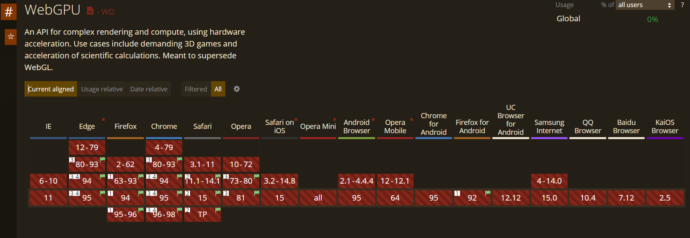
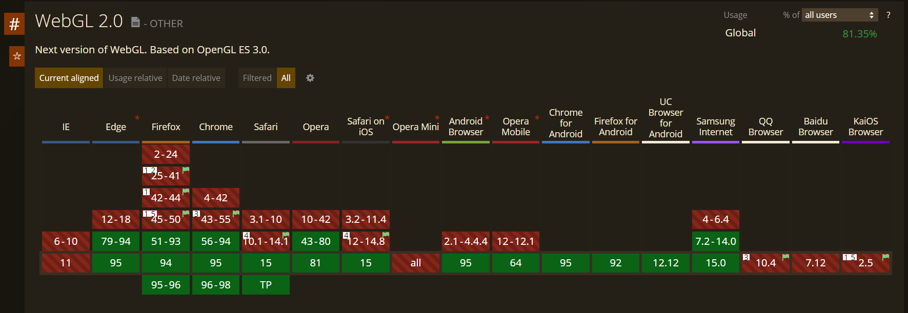
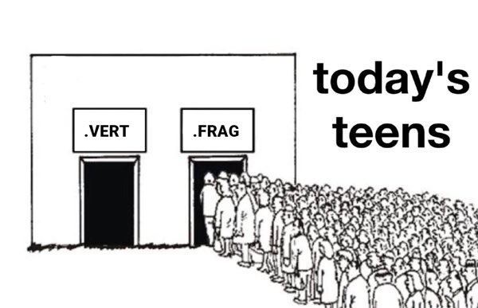
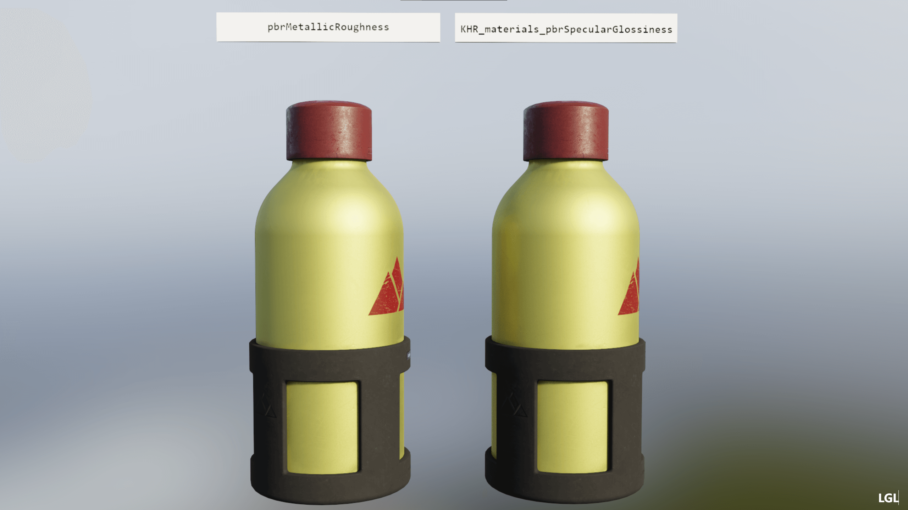

【WebGL与光线追踪】(三) 实践及工程化

前面的章节已经提供了全部的理论基础，剩下的就是如何实践落地到Web啦。

杠精回避宣言：后续内容有大量一家之言，如意见向左，皆为你对。

## 当前Web3D的现状

当前Web3D最新的API标准为WebGPU，可以说是代表着未来了，并且也在一直往前推进。但就目前(2021年11月)来看，离真正能在生产环境中广泛使用，依旧差很多：

  
  

什么时候能在Chrome上正式使用，其他浏览器又啥时候能够跟上，我个人对此持比较悲观的态度(4-5年?)。

好在是今年9月份发布的Safari 15正式开启了对WebGL2.0的默认支持，我们得以能在2021年不用再谈论WebGL1.0(1.0的痛，写过的都有感受)

  
  

所以在WebGPU真正得到广泛支持之前，WebGL2.0都将是Web3D在生产环境的主力选手，并且个人认为会持续很久。

关于WebGL2.0的介绍可参考：

https://webgl2fundamentals.org/webgl/lessons/webgl2-whats-new.html

## Previous work

然而对WebGL来说，只能通过Fragment Shader来借助GPU加速光追的一些计算，并没有其他能借助的手段。

所以劣势自不必说，啥CUDA、RTX，这些是梦里才有的，性能上肯定是被吊打。不过也有其好处，Fragment Shader在哪都能跑，并且WebGL2.0在手机端的支持还不错，所以甚至手机端都是可以展望一波的。

  
  

下面介绍一些前辈们在WebGL上已有的光追渲染器，以及一些它们的优缺点：

### THREE.js-PathTracing-Renderer

https://github.com/erichlof/THREE.js-PathTracing-Renderer

优点：

* 众多的Demo，其中包括了很多光追的高级算法实现(BDPT等)

* 甚至还离谱的适配了手机端

* 积极的在维护中

缺点：

* 几乎没有工程化，各个Demo实现都是近乎独立的一套

* 核心渲染还是使用的Threejs的WebGLRenderer(ShaderMaterial)，有Threejs版本依赖的隐患

### ray-tracing-renderer

https://github.com/hoverinc/ray-tracing-renderer

这位就更重量级了，之前Threejs是集成过这个renderer到主库的。并且前段日子Claygl开始维护

优点：

* 完备的工程化

* 插件化的实现架在Threejs之上，自己实现的Renderer接管后续所有渲染流程，没有版本依赖且方便高度优化

* 代码质量高，函数式编程

缺点：

* 貌似已不再维护，最后的提交停留在了2020年10月

* 对于gltf几个关键的特性实现不全(自发光、高光流)

### GLSL-PathTracer

https://github.com/knightcrawler25/GLSL-PathTracer

这虽然是一个C++项目，但本质相同，都是shader-based path tracing

优点：

* 代码精简且实现完备，材质实现了绝大部分的Disney BSDF参数

缺点：

* 毕竟还是C++，只能部分参考，比如它用的OpenImageDenoise(OIDN)，Web是没得用的，只能看着流口水，被搞心态

## 工程化

回到自己的渲染器，当前是参照ray-tracing-renderer以插件的形式架在Threejs上，最终打包为一个单独的lib对外，这样应该是最佳的实践方式，后续集成、维护和拓展都非常方便。

构建工具推荐直接使用Vite(锁定WebGL2后就压根不用担心ESM)，而且Web3D项目的构建需求相对Web前端项目简单很多：

* MPA：把examples的各个页面跑起来以便于调试，直接有现成的插件：[vite-plugin-mpa](https://github.com/IndexXuan/vite-plugin-mpa)
* Shader模块化：写个插件正则匹配关键字，然后替换成加载的shader chunk的内容即可

有一说一，热更新下秒刷新的Web3D开发，体验真是太过舒爽。一旦触碰，便会在你的内心埋入抗拒打开Visual Studio的种子

  
  

为了能方便的直接集成到已有的实时渲染系统中，对外的API都尽可能与Threejs保持一致（包括灯光参数等）

## 实践

1.实际生产环境中对GLTF规范中的自发光与高光流支持完全不可忽视，光有金属流不行，必须要添加支持。

两种工作流区别只在于贴图如何存储Diffuse和Refectivity

Metalness Workflow下，Metalness Map来区分金属和非金属，Albedo Map同时包含Diffuse(非金属)和Reflectivity(金属)信息，能同时包含是因为对非金属固定了0.04反射率，对金属固定没有漫反射。

Specular Workflow下，这两者则由单独的两张贴图直接对应。

[------

https://www.jianshu.com/p/0ec495c3904c

------]

  
  

2.构建BVH的过程可以交由Web Worker，已避免构建过程导致浏览器卡死的问题

3.可以使用tile渲染来适配低配机器

## 总结

首先是还待完善的部分
* 降噪：当前只添加了一个简单的ATours滤波，还未向后拓展
* 手机端：还未对手机端做适配

剩下的也没啥好说的啦。自己的最终计划是希望能做到整合实时和光追的编辑器的，也就是还要有实时渲染器(lglRenderer,目标是对齐Filament)，以及整合两者的编辑器(lglEditor)，从而完成大一统，心里美滋滋。

啊，该睡觉了，因为梦里啥都有。
