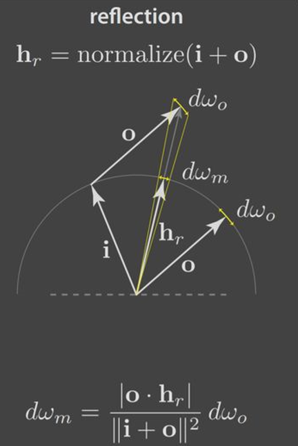
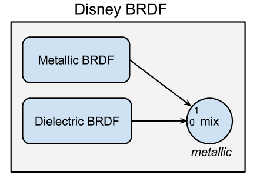
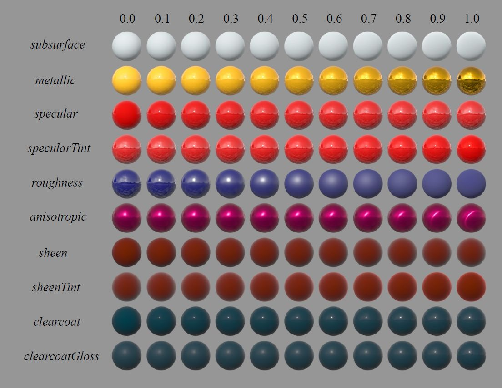
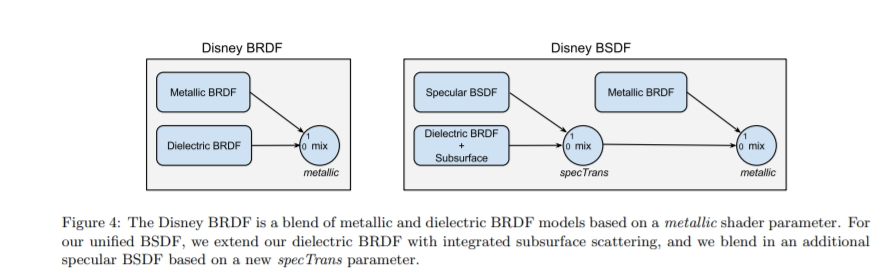
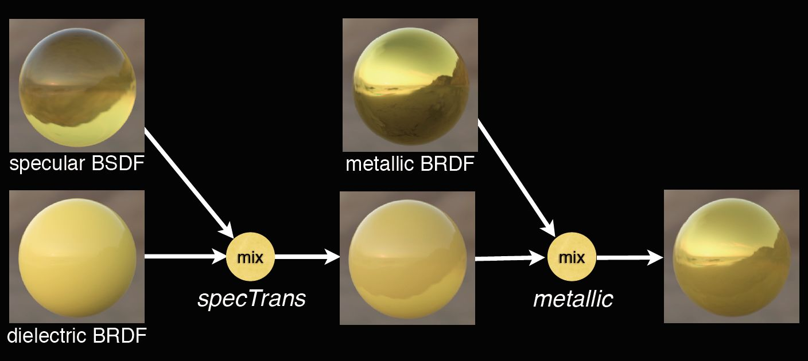
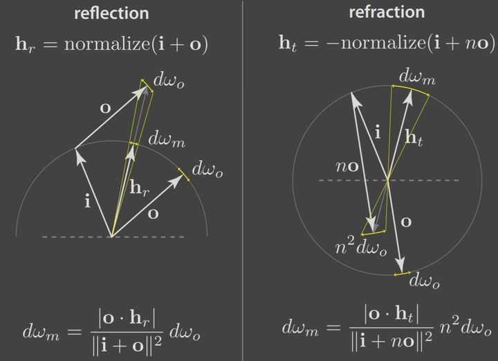
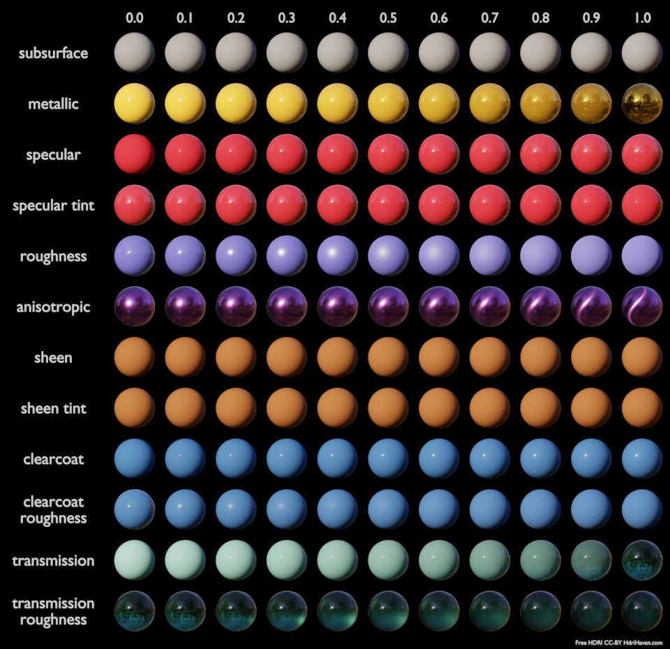

材质部分实现的是Disney BSDF，这里再做一次从基础开始的总结，比较熟悉的兄弟可直接跳过了哈

首先一切的一切，都得从渲染方程开始：

$$ L_{o}\left(p, \omega_{o}\right)=L_{e}\left(p, \omega_{o}\right)+\int_{\Omega^{+}} L_{i}\left(p, \omega_{i}\right) f_{r}\left(p, \omega_{i}, \omega_{o}\right)\left(n \cdot \omega_{i}\right) \mathrm{d} \omega_{i} $$

## 辐射度量学

而要理解渲染方程，得先回顾下辐射度量学的一些基本概念：

### **辐射能(radiant energy)**：

表示以辐射的形式发射、传播或接收的能量。单位为焦耳(J)，使用符号Q表示。每个光子都携带一定的能量，这个能量正比于它的频率v，h为普朗克常数：

$$ Q = hv $$ 

### **辐射通量(radiant flux)**：

表示光源每秒钟发射的功率，单位为瓦特(Watt)，使用符号$\Phi$表示：

$$ \Phi\equiv\frac{dQ}{dt} $$

辐射能量测量中通常都使用辐射通量

### **立体角(solid angle)**：

表示单位球体上一块区域对应的球面部分的面积，2D使用弧度表示“角度”大小，3D则使用单位球体上区域面积来表示对应“立体角”的大小。

常用 ω 来表示，单位为 sr(steradian，球面度)，其值为该角对应的面积除以半径的平方:

$$ \omega = \frac{A}{r^2} $$

微分视角下，可用弧长乘弧长的矩形面积来表示立体角对应的面积dA：

$$ dA = (dθ*r)*(dφ*r*\cosθ) $$

微分立体角即为：

$$ d\omega = \frac{dA}{r^2}=\sinθdθdφ $$

可顺带推出整个球的表面积：

$$ A=\int_{0}^{2\pi}\int_{0}^{\pi}dA = \int_{0}^{2\pi}\int_{0}^{\pi} \sin\theta r^{2}d\theta d \varphi = r^{2}\int_{0}^{2\pi}[-cos\theta]_{0}^{\pi}d \varphi = r^{2}[2\varphi]_{0}^{2\pi} = 4 \pi r^2 $$

### **辐射强度(radiant intensity)**：

表示单位立体角所对应的辐射通量，用 I 来表示，单位为 W/sr:

$$ I\equiv \frac{d\Phi}{d\omega} $$

### **辐射照度(irradiance)**：

表示单位面积接收到的辐射通量，使用E表示，单位为$W/m^2$：

$$ E\equiv\frac{d\Phi}{dA} $$

辐射强度随方向与面法线的夹角余弦变化而变化：

$$ E=\frac{d\Phi}{dA}\cos\theta $$

### **辐射亮度/辐射率(radiance)**：

表示单位面积下接收到的来自单位立体角的辐射通量，用 L 来表示，单位为$W/sr\cdot m^2$：

$$ L(p,\omega)=\frac{d^2\Phi}{d\omega dA^{\bot}}\\ $$

需要注意的是定义irradiance时面积元是$dA$，而定义radiance时是投影后的面积元${d} A^{\perp}$

微分视角下radiance即代表单束光线从某个方向射向某个位置的辐射通量（立体角足够小 => 代表方向，面积足够小 => 代表点）

### **radiance与irradiance的关系**：

设一束光线的辐射率为L(p,ω)，则可得ω方向上对P点贡献的辐照度dE(p,ω)为：

$$ dE(p,ω)=L(p,ω) cos\theta d\omega $$

最终P点的辐照度就应该是半球内所有光线提供的辐照度的积分（$\Omega^{+}$代表正半球域）：

$$ E(p)=\int_{\Omega^{+}}L_i(p,\omega_i)n\cdot \omega_i d\omega_i $$

回看渲染方程：

$$ L_{o}\left(p, \omega_{o}\right)=L_{e}\left(p, \omega_{o}\right)+\int_{\Omega^{+}} L_{i}\left(p, \omega_{i}\right) f_{r}\left(p, \omega_{i}, \omega_{o}\right)\left(n \cdot \omega_{i}\right) \mathrm{d} \omega_{i} $$

只看反射方程，现在就只剩下$f_r(p,\omega_i,\omega_o)$啦

## 双向反射分布函数（BRDF，Bidirectional Reflectance Distribution Function）

BRDF的定义是出射Radiance比入射Irradiance的比值，表示反射方向上radiance增量与入射方向irradiance增量的比率(以描述表面入射光与反射光的关系):

$$ f_r(p,\omega_i,\omega_o) = \frac{L(p,\omega_o)}{L(p,\omega_i)n\cdot \omega_i d\omega_i} $$

BRDF的两个性质：

1.赫姆霍兹互反定律：BRDF的入射方向和出射方向可以互换，值保持不变：

$$ f_r(p,\omega_i,\omega_o) = f_i(p,\omega_i,\omega_o) $$

2.能量守恒定律：所有反射的能量不能大于所有吸收的能量(不包括自发光)

$$ \int_{\Omega}f_r(p,\omega_i,\omega_o)n\cdot \omega_i d\omega_i <= 1$$

即给定一个入射方向，所有出射方向的BRDF积分值小于1

再回顾一些概念：

https://zhuanlan.zhihu.com/p/56967462 中的人眼视觉、物理光学(反射/折射/散射/吸收) 部分

### **菲涅尔方程**：

详细介绍可见：https://zhuanlan.zhihu.com/p/56967462 中的菲涅尔反射部分


菲涅尔方程描述了反射与折射的比率

因为菲涅尔反射率大部分范围内趋近于F0，所以F0也称为材质的特征镜面反射率(characteristic specular reflectance)，同时因为满足具有RGB分量且在0-1之间，通常还称为镜面颜色(specular color)

F0可通过折射率公式计算。折射到表面中的光量即为1-F0

$$
F_0 = (\frac{n_1-n_2}{n_1+n_2})^2 \\
$$

通常假设n1=1近似于空气的折射率，并用n替换n2

$$
F_0 = (\frac{n-1}{n+1})^2 \\
$$

折射定律：

$$
n1sinθ1=n2sinθ2
$$

大多数常见电介质的F0范围为0.02-0.05, 对于导体，F0范围为0.5-1.0


### **法线分布函数(Normal Distribution Function)**：

详细介绍可见：https://zhuanlan.zhihu.com/p/69380665


NDF描述了微观表面上的表面法线m的统计分布

明确定义：单位宏表面上法向量为m的微表面总面积的球面密度

仅在微观表面法线m等于宏观表面的半矢量h朝向相同的表面点，才**有机会**(最终能不能传播到还取决于G项)被观察到

NDF的本质是一个密度函数(即具有正确朝向的微表面法线浓度)，单位为1/球面度(1/steradians)

投影到宏观表面平面上的微平面区域，等于宏观表面的面积，即任何一个法线分布函数D(m)都必须满足在宏表面投影面积为1，投影D(m)(n·m)是被归一化的：

$$
\int_{\mathbf{m}\in \Theta} D(\mathbf{m})\mathbf{(n \cdot m)}d \mathbf{m} = 1 \\
$$

任何方向上微观表面投影面积始终与宏观表面投影面积相同（宏观法线n，微观法线m）

$$ \int_{\mathbf{m}\in \Theta} D(\mathbf{m})\mathbf{(v \cdot m)}d \mathbf{m} = \mathbf{v \cdot n} \\ $$

Θ符号表示在整球体上积分，半球积分用Ω表示。图形学中使用的大多数微结构模型都是高度场（heightfields），这意味着对于Ω外的所有方向，D(m) = 0。 但是，上式也适用于非高度场微观结构。


### **几何函数(Geometry Function)**

详细介绍可见：https://zhuanlan.zhihu.com/p/81708753


几何函数表示在具有半矢量法线的微平面中(满足了m = h)，未被遮挡的百分比。

两种微表面的交互行为：

* 阴影（Shadowing）表示微平面对入射光的遮挡，一般为对光源方向L而言
* 遮蔽（masking）表示微平面对出射光的遮挡，一般为对观察方向V而言

G与D的联系：

1.几何函数的解析形式的确认依赖于法线分布函数

2.法线分布函数需要结合几何函数，得到有效的法线分布强度


## **Cook-Torrance BRDF**

$$ f_{r}=k_{d} f_{lambert}+k_{s} f_{cook-torrance} \\ $$

### **漫反射项:**

也是从反射方程开始：

$$ L_o(\omega_{o}) = \int_\Omega f_{r} L_i(\omega_{i}) cos(\theta_i) d\omega_i $$

因为漫反射是均匀向整个半球方向反射(Labertian模型)，则$f_{r}$为常数，且$L_i$与方向无关，并且$L_o = cL_i$，c为反照率/固有色，表示光在介质内部出射部分比例

$$ L_o = f_{r} L_i \int_\Omega  cos(\theta_i) d\omega_i = c\pi f_{r} L_i $$

则：

$$ f_{lambert}=\frac{c}{\pi} \\ $$

**积分$\int _{\Omega} \cos \phi\, d\omega$的计算：**

$\int _{\Omega} \cos \phi\, d\omega$是半球积分，将其转为球坐标系可得:

$$ \int _{\Omega} \cos \phi\, d\omega = \int _{0} ^{2\pi} \int _{0} ^{\pi / 2} \sin \phi \,\cos \phi \,d\phi \,d\theta $$

换元：

$$ \int _{0} ^{\pi / 2} \sin \phi \cos \phi d\phi = \frac 1 2 \int _{0} ^{\pi / 2}  \sin \phi\, d(\sin \phi) = \frac 1 2 \sin^2(2\phi) | _{0} ^{\pi / 2} = \frac 1 2 (1^2 - 0^2) = \frac 1 2  $$

再带入后即可得：

$$ \int _{\Omega} \cos \phi\, d\omega = \int _{0} ^{2\pi} \frac 1 2 d\theta = \pi $$

### **镜面反射项:**

$$ f_{cook-torrance}=\frac{F(l, h) G(l, v) D(h)}{4(n \cdot l)(n \cdot v)} \\ $$

D(h)代表每单位面积中每单位立体角所有法向为h的微平面的面积

则对于面积为dA的微表面，出射面积即为：

$$ d^2A\left(\omega_{h}\right)=D\left(\omega_{h}\right) d \omega_{h} d A $$

$\omega_i$为入射方向，$\omega_o$为观察方向，$\omega_h$为微平面法向

$dA(\omega_h)$是微表面中法线方向为$\omega_h$的面积，入射面积即为这个面积投影到入射平面上:

$$cos(\theta_h)dA$$

设入射radiance为$L_{i}\left(\omega_{i}\right)$, 则入射的辐射通量：

$$ 
\begin{aligned} d^3\Phi_{i}&=L_{i}\left(\omega_{i}\right) d \omega_{i} d^2 A^{\perp}\left(\omega_{h}\right)\\&=L_{i}\left(\omega_{i}\right) d \omega_{i} \cos \theta_{h} d^2 A\left(\omega_{h}\right) \\&=L_{i}\left(\omega_{i}\right) d \omega_{i} \cos \theta_{h} D\left(\omega_{h}\right) d \omega_{h} d A \end{aligned} \\
$$

先不考虑F、G项的光线损失，则入射辐射通量等于出射辐射通量：

$$ d^3 \Phi_{o}=d^3 \Phi_{i} \\ $$

由radiance的定义，出射radiance为：

$$ d L_{o}\left(\omega_{o}\right)=\frac{d^3 \Phi_{o}}{d \omega_{o} \cos \theta_{o} d A}=\frac{ L_{i}\left(\omega_{i}\right) d \omega_{i} \cos \theta_{h} D\left(\omega_{h}\right) d \omega_{h} d A}{d \omega_{o} \cos \theta_{o} d A} \\ $$

再由BRDF定义：

$$ f_{cook-torrance}\left(\omega_{i}, \omega_{o}\right)=\frac{d L_{o}\left(\omega_{o}\right)}{d E_{i}\left(\omega_{i}\right)}=\frac{d L_{o}\left(\omega_{o}\right)}{L_{i}\left(\omega_{i}\right) \cos \theta_{i} d \omega_{i}}=\frac{\cos \theta_{h} D\left(\omega_{h}\right) d \omega_{h}}{\cos \theta_{o} \cos \theta_{i} d \omega_{o}} \\ $$

$\theta_i$是入射光线$\omega_i$与宏观法线方向n的夹角，$\theta_o$是出射光线$\omega_o$与宏观法线方向n的夹角，$\theta_h$是入射光线$\omega_i$与微平面法线方向$\omega_h$的夹角

最后问题化简为了求

$$\frac{d\omega_h}{d\omega_o}$$

<div style="text-align: center">  
  
</div>

可得：

$$ {d\omega_h} = \frac{ cos\theta_h}{{|h_r|^2}}d\omega_o$$

由余弦定理：

$$ \frac{d\omega_h}{d\omega_o} = \frac{cos\theta_h}{1+1-2*cos(\pi-2\theta_h)} =  \frac{1}{4cos\theta_h}\\ $$


法二：

多重积分换元需要乘一项Jacobian行列式，几何意义代表面积变化的比例
，在这里可以直接两个面积比(单位球面的角度微元等于面积微元)：$\lim_{d_{\omega_o} \to 0}\frac{d{\omega_h}}{d{\omega_o}}$，（硬拿雅克比行列式算过程可参考[这里](https://zhuanlan.zhihu.com/p/21489591)）

法三：

通过以$\omega_i$作为z轴建立球面坐标系, 因为$\omega_i, \omega_o$关于$\omega_h$对称，$\theta_o' = 2\theta_h'=2\theta_h$, 可得：

$$ d\omega_h=sin \theta_{\mathrm{h}} \mathrm{d} \theta_{\mathrm{h}} \mathrm{d} \phi $$

$$ d\omega_o=sin2\theta_h *2d\theta_h*d\phi=4sin\theta_hcos\theta_hd\theta_hd\phi $$


化简之后可得：

$$ \frac{d\omega_h}{d\omega_o} = \frac{1}{4cos\theta_h} \\ $$

最后再把F、G项带入即可得：

$$ f_{cook-torrance}\left(\omega_{i},\omega_{o}\right)=\frac{F_{r}\left(\omega_{o},\omega_h \right) D\left(\omega_{h}\right) G\left(\omega_{i}, \omega_{o}\right)}{4 \cos \theta_{o} \cos \theta_{i}} \\ $$

## Disney Principled BRDF

这里推荐直接一波四合一套餐：

[Disney BRDF Shader](https://github.com/wdas/brdf/blob/main/src/brdfs/disney.brdf)

[Disney BRDF Paper](https://media.disneyanimation.com/uploads/production/publication_asset/48/asset/s2012_pbs_disney_brdf_notes_v3.pdf)

[paper概括](https://zhuanlan.zhihu.com/p/60977923)

[实践总结](https://zhuanlan.zhihu.com/p/57771965)

核心microfacet模型：

$$ f(l,v)=\textrm{diffuse}+ \frac{D(\theta_h)F(\theta_d)G(\theta_l,\theta_v)}{4\ cos\theta_lcos \theta_v} \\ $$

通过对实际材质、现有公式效果的观察及对比，从而得出最后的经验模型:

```glsl
return ((1 / PI) * mix(Fd, ss, subsurface) * Cdlin + Fsheen) * (1 - metallic) + Gs * Fs * Ds + .25 * clearcoat * Gr * Fr * Dr;
```

**漫反射项：Disney Diffuse**

观察发现Lambert漫反射模型在边缘太暗，最后使用了Schlick近似，但丢弃菲涅尔因子的折射率，并假定没有入射能量的损失，再修改让掠射逆反射（grazing retroreflection response）和粗糙度挂钩，得到一个新的经验模型:

$$ f_d = \frac{baseColor}{\pi }(1+(F_{D90} -1)(1-cos\theta _l)^{5})(1 + (F_{D90}-1)(1-cos\theta _v)^5)  \\ $$

$$F_{D90} = 0.5 + 2 \ roughness \ cos^{2}\theta_d$$

$\theta_d$ 是入射方向$\boldsymbol w_i$与half vector $\boldsymbol \omega_h = \mathrm{normalize(\boldsymbol w_i + \boldsymbol w_o)}$ 的夹角。

这样即使$\theta_d$到90度时，边缘暗度依旧限制在0.5，并且逆反射也随粗糙增加而增加。

```glsl
float SchlickFresnel(float u) {
    float m = clamp(1-u, 0, 1);
    float m2 = m*m;
    return m2*m2*m; // pow(m,5)
}
// Diffuse fresnel - go from 1 at normal incidence to .5 at grazing
// and mix in diffuse retro-reflection based on roughness
float FL = SchlickFresnel(NdotL), FV = SchlickFresnel(NdotV);
float Fd90 = 0.5 + 2 * LdotH*LdotH * roughness;
float Fd = mix(1.0, Fd90, FL) * mix(1.0, Fd90, FV);
```

次表面散射部分没有用复杂模型，而是使用了一个BRDF([Hanrahan-Krueger BRDF](https://cseweb.ucsd.edu/~ravir/6998/papers/p165-hanrahan.pdf)的改进)进行近似：

$$ \begin{aligned} &f_\mathrm{subsurface} = 1.25\frac{\mathrm{baseColor}}{\pi}(F_{ss} (1 / (\cos\theta_i + \cos\theta_o) - 0.5) + 0.5) \\ &F_{ss} = (1 + (F_{ss90} - 1)(1 - \cos\theta_i)^5)(1 + (F_{ss90} - 1)(1 - \cos\theta_o)^5) \\ &F_{ss90} = \cos^2\theta_d\mathrm{roughness} \end{aligned} \\ $$

代码部分：

```glsl
// Based on Hanrahan-Krueger brdf approximation of isotropic bssrdf
// 1.25 scale is used to (roughly) preserve albedo
// Fss90 used to "flatten" retroreflection based on roughness
float Fss90 = LdotH*LdotH*roughness;
float Fss = mix(1.0, Fss90, FL) * mix(1.0, Fss90, FV);
float ss = 1.25 * (Fss * (1 / (NdotL + NdotV) - .5) + .5);
```

**法线分布项（Specular D）：GTR**

GTR的公式及推导可见paper的附录(p24-p25)

各项同性：

$$ D_{GTR} = c/(\alpha ^{2} cos ^{2}\theta _h + sin^{2}\theta _h)^\gamma \\ $$

* γ=1时，GTR即Berry分布

* γ=2时，GTR即Trowbridge-Reitz分布

Disney BRDF中有两处使用了GTR函数，一处是高光项(各项同性+各项异性)，另一处是清漆的反射。高光项中，$\gamma$值为2，清漆项中，$\gamma$值为1

代码部分：

```glsl
float GTR1(float NdotH, float a) {
    if (a >= 1) return 1/PI;
    float a2 = a*a;
    float t = 1 + (a2-1)*NdotH*NdotH;
    return (a2-1) / (PI*log(a2)*t);
}

float GTR2(float NdotH, float a) {
    float a2 = a*a;
    float t = 1 + (a2-1)*NdotH*NdotH;
    return a2 / (PI * t*t);
}
```

各项异性：


$$ D(\theta_h, \phi_h) = \frac{c}{\left(\sin^2\theta_h\left(\dfrac{\cos^2\phi}{\alpha_x^2} + \dfrac{\sin^2\phi}{\alpha_y^2}\right) + \cos^2\theta_h\right)^\gamma}\\

$$
其中：
$$
\begin{aligned} \alpha_x &= \mathrm{roughness}^2 / a \\ \alpha_y &= \mathrm{roughness}^2 * a \\ a &= \sqrt{1 - 0.9\mathrm{anisotropic}} \end{aligned}\\
$$

由

$$ \int_{\mathcal H^2}\cos\theta_h D(\theta_h, \phi_h)d\omega_h = 1\\ $$

及$\gamma$ = 2，可得：

$$ \begin{aligned} &\int_{\mathcal H^2}\frac{c\cos\theta_h}{\left(\sin^2\theta_h\left(\frac{\cos^2\phi}{\alpha_x^2} + \frac{\sin^2\phi}{\alpha_y^2}\right) + \cos^2\theta\right)^2}d\omega_h \\ = &c\int_{0}^{2\pi}\int_{0}^{\pi/2}\frac{\sin\theta_h\cos\theta_h}{\left(\sin^2\theta_h\left(\frac{\cos^2\phi}{\alpha_x^2} + \frac{\sin^2\phi}{\alpha_y^2}\right) + \cos^2\theta\right)^2}d\theta_h d\phi_h \\ = &\frac c 2 \int_0^{2\pi}\frac 1 {\frac{\cos^2\phi_h}{\alpha_x^2} + \frac{\sin^2\phi_h}{\alpha_y^2}}d\phi_h = \pi\alpha_x\alpha_yc = 1 \end{aligned}\\
$$

解得$c = 1 / (\pi\alpha_x\alpha_y)$, 即：

$$ D(\theta_h, \phi_h) = \frac 1 {\pi\alpha_x\alpha_y\left(\sin^2\theta_h\left(\frac{\cos^2\phi}{\alpha_x^2} + \frac{\sin^2\phi}{\alpha_y^2}\right) + \cos^2\theta_h\right)^2}\\ $$


代码部分：

```glsl
float GTR2_aniso(float NdotH, float HdotX, float HdotY, float ax, float ay) {
    return 1 / (PI * ax*ay * sqr( sqr(HdotX/ax) + sqr(HdotY/ay) + NdotH*NdotH ));
}
```

NDF关联重要性采样的PDF计算：

$$ p(\boldsymbol \omega_i) = p(\boldsymbol \omega_h)\frac{d\omega_h}{d\omega_i} = p(\boldsymbol \omega_h)\frac{1}{4(\omega_h \cdot \omega_i)} = \frac{D(\theta_h, \phi_h)\cos\theta_h}{4(\omega_h \cdot \omega_i)}\\ $$

**菲涅尔项（Specular F）：Schlick Fresnel**

Disney使用的还是Schlick Fresnel近似

$$  F_{Schlick}=F_0+(1-F_0)(1-cos\theta _d)^5 \\$$

代码部分：

```glsl
float SchlickFresnel(float u) {
    float m = clamp(1-u, 0, 1);
    float m2 = m*m;
    return m2*m2*m; // pow(m,5)
}
float FH = SchlickFresnel(LdotH);
vec3 Fs = mix(Cspec0, vec3(1), FH);
```

**几何项（Specular G）：Smith-GGX**

Disney使用了Smith GGX导出的G项:

$$ G\mathbf{(l,v,h)}= G_1{(\mathbf{l})} \ G_1{(\mathbf{v})} \\  $$

各项同性：


$$ G\mathbf{(l,v,h)}= G_1{(\mathbf{l})} \ G_1{(\mathbf{v})} \\  
G_1(\mathbf{v})=\frac{2 (\mathbf{n\cdot v})}{(\mathbf{n\cdot v}) + \sqrt{\alpha ^{2}+(1- \alpha^{2})(\mathbf{n\cdot v)^{2}}}}
$$


```glsl
float smithG_GGX(float NdotV, float alphaG) {
    float a = alphaG*alphaG;
    float b = NdotV*NdotV;
    return 1 / (NdotV + sqrt(a + b - a*b));
}
// clearcoat
float Gr = smithG_GGX(NdotL, .25) * smithG_GGX(NdotV, .25);
```

各项异性：


$$ \begin{aligned} &G_1(\boldsymbol \omega) = \frac 1 {1 + \Lambda(\boldsymbol \omega)} \\ &\Lambda(\boldsymbol \omega) = -\frac 1 2 + \frac 1 2 \sqrt{1 + (\alpha_x^2\cos^2\phi + \alpha_y^2\sin^2\phi)\tan^2\theta} \end{aligned}\\ $$


```glsl
float smithG_GGX_aniso(float NdotV, float VdotX, float VdotY, float ax, float ay) {
    return 1 / (NdotV + sqrt( sqr(VdotX*ax) + sqr(VdotY*ay) + sqr(NdotV) ));
}

float Gs;
Gs  = smithG_GGX_aniso(NdotL, dot(L, X), dot(L, Y), ax, ay);
Gs *= smithG_GGX_aniso(NdotV, dot(V, X), dot(V, Y), ax, ay);
```

**Sheen**

通过对布料材质的观察，发现缺了一个类似菲涅尔项的额外的掠射反射量。Disney BRDF也就直接多加了个缩放的Schlick公式来进行模拟: $sheen * (1 - \cos\theta_d)^5$，并且还添加sheenTint参数进行颜色控制

代码部分：

```glsl
vec3 Cdlin = mon2lin(baseColor);
float Cdlum = .3*Cdlin[0] + .6*Cdlin[1]  + .1*Cdlin[2]; // luminance approx.
vec3 Ctint = Cdlum > 0 ? Cdlin/Cdlum : vec3(1); // normalize lum. to isolate hue+sat
vec3 Cspec0 = mix(specular*.08*mix(vec3(1), Ctint, specularTint), Cdlin, metallic);

vec3 Csheen = mix(vec3(1), Ctint, sheenTint);
float FH = SchlickFresnel(LdotH);
vec3 Fsheen = FH * sheen * Csheen;
```

**ClearCoat**

清漆项的次级波瓣，F项固定取折射率为1.5的绝缘体，NDF取$\gamma = 1$的各向同性GTR函数，G项是直接固定粗糙度为0.25的GGX遮蔽项：

```glsl
// clearcoat (ior = 1.5 -> F0 = 0.04)
float Dr = GTR1(NdotH, mix(.1,.001,clearcoatGloss));
float Fr = mix(.04, 1.0, FH);
float Gr = smithG_GGX(NdotL, .25) * smithG_GGX(NdotV, .25);
// Fin => .25*clearcoat*Gr*Fr*Dr
```
### **汇总**

<div style="text-align: center">  
  
</div>

$$
\begin{aligned} f_\text{disney}(\boldsymbol \omega_i, \boldsymbol \omega_o) =~&\left(\frac{C}{\pi}\mathrm{mix}(f_d(\boldsymbol \omega_i, \boldsymbol \omega_o), f_{ss}(\boldsymbol \omega_i, \boldsymbol \omega_o), \sigma_{ss}) + f_{sh}(\boldsymbol \omega_i, \boldsymbol \omega_o)\right) (1 - \sigma_m)\\ +~&\frac{F_s(\theta_d)G_s(\boldsymbol \omega_i, \boldsymbol \omega_o)D_s(\boldsymbol \omega_h)}{4\cos\theta_i\cos\theta_o} \\ +~&\frac {\sigma_c} 4 \frac{F_c(\theta_d)G_c(\boldsymbol \omega_i, \boldsymbol \omega_o)D_c(\boldsymbol \omega_i, \boldsymbol \omega_o)}{4\cos\theta_i\cos\theta_o} \end{aligned}\\
$$

```glsl
return ((1 / PI) * mix(Fd, ss, subsurface) * Cdlin + Fsheen) * (1 - metallic) + Gs * Fs * Ds + .25 * clearcoat * Gr * Fr * Dr;
```

Disney BRDF的所有参数：

<div style="text-align: center">  
  
</div>


$$
\begin{aligned} C &= \mathrm{baseColor} \\ \sigma_m &= \mathrm{metallic} \\ \sigma_{ss} &= \mathrm{subsurface} \\ \sigma_s &= \mathrm{specular} \\ \sigma_{st} &= \mathrm{specularTint} \\ \sigma_r &= \mathrm{roughness} \\ \sigma_a &= \mathrm{anisotropic} \\ \sigma_{sh} &= \mathrm{sheen} \\ \sigma_{sht} &= \mathrm{sheenTint} \\ \sigma_{c} &= \mathrm{clearcoat} \\ \sigma_{cg} &= \mathrm{clearcoatGloss} \end{aligned}\\
$$

其中$f_d$为漫反射：

$$
\begin{aligned} f_d(\boldsymbol \omega_i, \boldsymbol \omega_o) &= (1 + (F_{D90} - 1)(1 - \cos\theta_i)^5)(1 + (F_{D90} - 1)(1 - \cos\theta_o)^5) \\ F_{D90} &= 0.5 + 2\cos^2\theta_d\sigma_r \end{aligned}\\
$$

$f_{ss}$为次表面散射项：

$$
\begin{aligned} f_{ss}(\boldsymbol \omega_i, \boldsymbol \omega_o) &= 1.25(F_{ss} (1 / (\cos\theta_i + \cos\theta_o) - 0.5) + 0.5) \\ F_{ss} &= (1 + (F_{ss90} - 1)(1 - \cos\theta_i)^5)(1 + (F_{ss90} - 1)(1 - \cos\theta_o)^5) \\ F_{ss90} &= \cos^2\theta_d\sigma_r \end{aligned}\\
$$

$f_{sh}$为sheen项：

$$
\begin{aligned} f_{sh}(\boldsymbol \omega_i, \boldsymbol \omega_o) &= \mathrm{mix}(\mathrm{one}, C_{tint}, \sigma_{sht})\sigma_{sh}(1 - \cos\theta_d)^5 \\ C_{tint} &= \frac{C}{\mathrm{lum}(C)} \end{aligned}\\

\mathrm{lum}(C) \approx 0.2126 \times C.r + 0.7152 \times C.g + 0.0722 \times C.b\\
$$

$F_{s}$是高光的frensel项，用Schlick公式做了近似。对绝缘体而言，Schlick公式中的垂直入射反射比例 $R_{0}$可以用一个实数表示；而对金属而言，$R_{0}$是带有颜色信息的，也就是金属工作流，因此Disney BRDF利用金属度参数在两种情况间进行了插值：

$$
\begin{aligned} F_s(\theta_d) &= C_s + (1 - C_s)(1 - \cos\theta_d)^5 \\ C_s &= \mathrm{mix}(0.08\sigma_s\mathrm{mix}(\mathrm{one}, C_{tint}, \sigma_{st}), C, \sigma_m) \end{aligned}\\
$$

$G_{s}$是高光的遮蔽项，采用各向异性GGX对应的Smith函数

$$
\begin{aligned} G_s(\boldsymbol \omega_i, \boldsymbol \omega_o) &= G_{s1}(\boldsymbol \omega_i)G_{s1}(\boldsymbol \omega_o) \\ G_{s1}(\boldsymbol \omega) &= \frac 1 {1 + \Lambda_s(\boldsymbol \omega)} \\ \Lambda_s(\boldsymbol \omega) &= -\frac 1 2 + \frac 1 2 \sqrt{1 + (\alpha_x^2\cos^2\phi + \alpha_y^2\sin^2\phi)\tan^2\theta} \end{aligned}\\
$$

$D_{s}$是高光的微表面法线分布函数，采用各向异性GTR2函数（其实就是GGX）：

$$
\begin{aligned} D_s(\boldsymbol \omega_h) &= \frac 1 {\pi\alpha_x\alpha_y\left(\sin^2\theta_h\left(\frac{\cos^2\phi}{\alpha_x^2} + \frac{\sin^2\phi}{\alpha_y^2}\right) + \cos^2\theta_h\right)^2} \\ \alpha_x &= \sigma_r^2 / a \\ \alpha_y &= \sigma_r^2 a \\ a &= \sqrt{1 - 0.9\sigma_a} \end{aligned}\\
$$

$F_{c}$是清漆的fresnel项，采用折射率固定为1.5的绝缘体对应的Schlick公式：

$$
F_c(\theta_d) = 0.04 + 0.96(1 - \cos\theta_d)^5\\
$$


$G_{c}$是清漆的遮蔽项，采用粗糙度为0.25的各向同性GGX对应的Smith函数：

$$
\begin{aligned} G_c(\boldsymbol \omega_i, \boldsymbol \omega_o) &= G_{c1}(\boldsymbol \omega_i)G_{c1}(\boldsymbol \omega_o) \\ G_{c1}(\boldsymbol \omega) &= \frac 1 {1 + \Lambda_c(\boldsymbol \omega)} \\ \Lambda_c(\boldsymbol \omega) &= -\frac 1 2 + \frac 1 2 \sqrt{1 + \alpha^2\tan^2\theta} \end{aligned}\\
$$

$D_{c}$是清漆的微表面法线分布，采用各向同性的GTR1函数：

$$
\begin{aligned} D_c(\boldsymbol \omega_h) &= \frac {\alpha^2 - 1} {2\pi\ln\alpha(\alpha^2\cos^2\theta_h + \sin^2\theta_h)} \\ \alpha &= \mathrm{mix}(0.1, 0.01, \sigma_{cg}) \end{aligned}\\
$$


## **Disney BSDF**

<div style="text-align: center">  
  
</div>

<div style="text-align: center">  
  
</div>

Disney BRDF本质是金属BRDF和非金属BRDF的插值模型(通过metallic)，而Disney BSDF本质是金属BRDF、非金属BRDF、与Specular BSDF三者的插值模型(通过specTrans、metallic)。

### **Dielectric BRDF + Subsurface**

**先回看BRDF的Fd：**

$$ f_{d} = \frac{baseColor}{\pi}\left( 1 +\left( F_{D90} - 1  \right) \left( 1 - cos \theta_{l} \right)^{5} \right)\left( 1 +\left( F_{D90} - 1  \right) \left( 1 - cos \theta_{v} \right)^{5} \right) $$

$$ F_{D90} = 0.5 + 2 \times roughness\times cos^{2}\theta_{d} $$


1.光滑的次表面散射模型

Diffuse入的能量自然是扣完反射部分的，也就是1-菲涅尔项(即$1-\left( 1 - \left(n \cdot l\right)^{+} \right)^{5}$)，出的时候还得再扣一次，也就是再乘$1-\left( 1 - \left(n \cdot v\right)^{+} \right)^{5}$

2.粗糙的次表面散射模型

需要考虑补上逆射（retro-reflection）效果，表面越粗糙，在掠射角处，反而有越多的微平面是垂直于光线的现象。观察到兰伯特漫反射边缘本就很暗，再加上1-菲涅尔项项，结果变得更暗。

BRDF的Fd就是混合了两个模型的经验模型，直观上看很矛盾：越掠射菲涅尔反射越强，所以留给次表面散射的能量就少，但是逆射又越强。那么到底谁强谁弱呢，取决于粗糙度，$F_{D90}$ 大于1时，越掠射反射越强；小于1时，越掠射反射越弱。而粗糙度决定了这个临界点出现的早晚


**BSDF对Fd的改进：**

1.具体思路是将漫反射波瓣重构为两部分: 方向性的微表面效应（microsurface effect），主要为逆反射（retroreflection）；非方向性的次表面效应（subsurface effect），即Lambertian漫反射。


为了扩展支持次表面散射，首先将漫反射波瓣重构为两部分：方向性微表面效果(主要就是逆射增益)和非方向性（即Lambertian）次表面效果，然后再用扩散模型或体积散射模型去替换Lambertian部分。这样就保留下微表面效果的同时支持了次表面散射，当散射距离较小时，散射模型也可以收敛到与原BRDF相同的结果：

$$  
f_{d} = f_{Lambert}\left( 1 - 0.5F_{L} \right)\left( 1 - 0.5F_{V} \right) + f_{retro-reflection} 
$$
$$
f_{Lambert} = \frac{baseColor}{\pi}
$$
$$
f_{retro-reflection} = \frac{baseColor}{\pi}R_{R}\left( F_{L} + F_{V} + F_{L}F_{V}\left( R_{R} - 1 \right) \right)
$$

其中：
$$
F_{L} = \left( 1 - cos \theta_{l} \right)^{5} 
$$
$$
F_{V} = \left( 1 - cos \theta_{v} \right)^{5} 
$$
$$
R_{R} =2 \times roughness\times cos^{2}\theta_{d}
$$

**Subsurface diffusion：**


Disney通过蒙特卡洛模拟（Monte Carlo simulation），观察到对于典型的散射参数，包括单次散射的扩散剖面（diffusion profile），使用两个指数项的总和（a sum of two exponentials）便可以很好地进行模拟，且得到了比偶极子剖面（dipole diffusion）更好的渲染结果。


通过观察发现能由两个指数之和很好地近似包括单次散射的散射曲线：

$$
R_{d}\left( r \right) = \frac{e^{-\frac{r}{d}}+e^{-\frac{r}{3d}}}{8\pi dr}
$$

扩散模型本质上仍然只是对次表面散射的近似，是用公式对真实次表面散射随扩散距离变化曲线的拟合


其中，d是艺术家调整的平均扩散距离（物理上取决于albedo和平均自由程），r就是采样点与当前要评估brdf的着色点之间的距离。只要采样周围点的入射光，并乘以该距离对应的反射率$R_{d}$即可。


直言Todo

### **Specular BSDF（Bidirectional Scattering Distribution Function）**

Specular BSDF = Specular BRDF + Specular BTDF（Bidirectional transmittance distribution function）, BRDF的微平面反射lobe扩展到折射，积分域从半球扩展到整个球。

$$ f_{s}\left( i,o,n \right)  = f_{r}\left( i,o,n \right)  + f_{t}\left( i,o,n \right) $$

反射与折射的半矢量：

$$h_{r} = \frac{i + o}{\left|\left| i + o \right|\right|}$$

$$h_{t} = - \frac{i + \eta  o}{\left| \left| i + \eta o \right|\right|}$$

推导： 

$$
\eta_{i} \theta_{i} = \eta_{o} \theta_{o}
$$

$$
\eta =  \frac{\eta_{o}}{\eta _{i}}  = \frac{\theta_{i}}{\theta_{o}} = \frac{cos\left( \frac{\pi}{2} - \theta_{i} \right)}{cos\left( \frac{\pi}{2} - \theta_{o} \right)} = \frac{h_{t} \cdot i}{-h_{t} \cdot o} => h_{t} = - \frac{i + \eta  o}{\left| \left| i + \eta o \right|\right|}
$$

代码部分：

```glsl
bool refl = dot(N, L) > 0.0;
if (refl) {
    H = normalize(L + V);
} else {
    H = normalize(L + V * si.eta);
}

if (dot(V, H) < 0.0)
    H = -H;
```

brdf和btdf的推导：

https://www.pbr-book.org/3ed-2018/Reflection_Models/Microfacet_Models

由前面cook-torrance的推导：

$$ f_{cook-torrance}\left(\omega_{i}, \omega_{o}\right)=\frac{d L_{o}\left(\omega_{o}\right)}{d E_{i}\left(\omega_{i}\right)}=\frac{d L_{o}\left(\omega_{o}\right)}{L_{i}\left(\omega_{i}\right) \cos \theta_{i} d \omega_{i}}=\frac{\cos \theta_{h} D\left(\omega_{h}\right) d \omega_{h}}{\cos \theta_{o} \cos \theta_{i} d \omega_{o}} \\ $$

之前只考虑了反射，这里还需要考虑折射的情况：

问题又回到了求

$$\frac{d\omega_m}{d\omega_o}$$

由相似三角形以及定义公式：

$$d\omega = \frac{dA}{r^2}$$

可得： 

<div style="text-align: center">  
  
</div>

对于反射的情况，带入可得：

$$
f_{r}\left( i, o \right) = \frac{ \left| i \cdot h_{r} \right| \left| o \cdot h_{r} \right|}          { cos\theta_{i}cos\theta_{o} \left| \left| i + o \right| \right|^{2}} F \left( i, h_{r} \right)G\left( i, o, m \right)D\left( m \right)
$$

最后化简可得：

$$
f_{r}\left( i, o \right) = \frac{F \left( i, h_{r} \right) G\left( i, o, m \right)D\left( m \right) }          { 4cos\theta_{i}cos\theta_{o}}
$$

代码部分：

```glsl
vec3 EvalDielectricReflection(SurfaceInteraction si, vec3 V, vec3 N, vec3 L, vec3 H, inout float pdf) {
    pdf = 0.0;
    if (dot(N, L) <= 0.0)
		return vec3(0.0);

    float F = DielectricFresnel(dot(V, H), si.eta);
    float D = GTR2(dot(N, H), si.roughness);
    // MicrofacetReflection::Sample_f
    pdf = D * dot(N, H) * F / (4.0 * abs(dot(V, H)));

    float G = SmithG_GGX(abs(dot(N, L)), si.roughness) * SmithG_GGX(abs(dot(N, V)), si.roughness);
    return si.color * F * D * G;
}
```

折射的情况带入，没得化简，直接可得：

$$
f_{r}\left( i, o \right) = \frac{ \left| i \cdot h_{t} \right| \left| o \cdot h_{t}  \right| \eta^{2}}          { cos\theta_{i}cos\theta_{o} \left| \left| i + \eta o \right| \right|^{2}} (1-F \left( i, h_{r} \right))G\left( i, o, m \right)D\left( m \right)
$$

代码部分：

```glsl
// https://www.pbr-book.org/3ed-2018/Reflection_Models/Microfacet_Models
vec3 EvalDielectricRefraction(SurfaceInteraction si, vec3 V, vec3 N, vec3 L, vec3 H, inout float pdf) {
    pdf = 0.0;
    if (dot(N, L) >= 0.0)
        return vec3(0.0);

    float F = DielectricFresnel(abs(dot(V, H)), si.eta);
    float D = GTR2(dot(N, H), si.roughness);

    // MicrofacetTransmission::Pdf
    float denomSqrt = dot(L, H) + dot(V, H) * si.eta;
    pdf = D * dot(N, H) * (1.0 - F) * abs(dot(L, H)) / (denomSqrt * denomSqrt);

    float G = SmithG_GGX(abs(dot(N, L)), si.roughness) * SmithG_GGX(abs(dot(N, V)), si.roughness);
    // 乘4是补V项多除掉的4
    return si.color * (1.0 - F) * D * G * abs(dot(V, H)) * abs(dot(L, H)) * 4.0 * si.eta * si.eta / (denomSqrt * denomSqrt);
}
```

此外的几项：

**1.clearcoat**

直接从BRDF接过来，未做改变，贡献额外的反射，不参与折射

代码部分：

```glsl
vec3 EvalClearcoat(SurfaceInteraction si, vec3 V, vec3 N, vec3 L, vec3 H, inout float pdf) {
    float NDotL = dot(N, L);

    pdf = 0.0;
    if (NDotL <= 0.0)
        return vec3(0.0);
    
    float NDotV = dot(N, V);
    float NDotH = dot(N, H);
    float LDotH = dot(L, H);

    float D = GTR1(NDotH, mix(0.1, 0.001, si.clearcoatGloss));
    pdf = D * NDotH / (4.0 * LDotH);

    float FH = SchlickFresnel(LDotH);
    float F = mix(0.04, 1.0, FH);
    float G = SmithG_GGX(NDotL, 0.25) * SmithG_GGX(NDotV, 0.25);
    return vec3(0.25 * si.clearcoat * F * D * G);
}
```

**2.surface absorption**（表面吸收）

将折射结果乘以表面颜色的平方根，在考虑了进入和离开的散射事件后，产生预期反射率

ToCheck in pbrt

**3.volumetric absorption**（体积吸收）

根据折射路径长度来应用体积吸收，并且参数化。

由Beer-Lambert定律可得公式：

$$T = e^{−σ_{a} d}$$

其中：T为透射率，$σ_{a}$为吸收系数，d为距离。则通过增加两个参数透射颜色(extinction)和距离系数(atDistance)，就可以反转透射方程来计算吸收系数：

$$σ_{a} = -log(T)/d$$

代码部分：

```glsl
if (dot(si.normal, si.ffnormal) > 0.0) {
	path.absorption = vec3(0.0);
}
// ToCheck: why exp here
path.beta *= exp(-path.absorption * si.t);
if (dot(si.ffnormal, bsdfSampleRec.L) < 0.0) {
	path.absorption = -log(si.extinction) / si.atDistance;
}
```
**4.sheen**

也是直接从BRDF接过来，未做改变。尽管是非物理的，但是可以用来补偿当前微表面模型不考虑多次反射/折射所丢失的能量(手动版Kulla-Conty Approximation)

代码部分：

```glsl
vec3 Csheen = mix(vec3(1.0), Ctint, si.sheenTint);
vec3 Fsheen = FH * si.sheen * Csheen;
```


**5.Thin-surface BSDF**

Disney还提供了另一种薄面模型

未做实践

1.新增diffTrans参数，用以插值反射的diffuse和透射的diffuse（因为是薄表面，所以可以直接建模成diffuse出去，而不必考虑多次散射）。就是把原本brdf diffuse分到的能量，又分成了两份

2.透射的diffuse只是简单使用了兰伯特漫反射，而反射出来的diffuse跟原模型一样，只是次表面散射仍然使用ss项简单应付一下，不过改名成了flatness来插值漫反射和次表面散射，以避免与真正的次表面散射混淆。

3.由于薄表面上的折射引起的弯曲被近似抵消（光线进出相互抵消），所以折射并未改变方向。但是两次折射却会放大或减弱透射模糊，因此还基于IOR缩放透射Specular的粗糙度：

$$(0.65 * \eta - 0.35) * rough$$

整体而言，薄面模型比起固体模型透射模糊效果更淡，但仍随着折射率逐渐变大


### **汇总**

Blender对Disney BSDF实现的所有参数：

<div style="text-align: center">  
  
</div>

所有lglTracer的实际代码还待检验

Todo：BSSRDF from Atrc